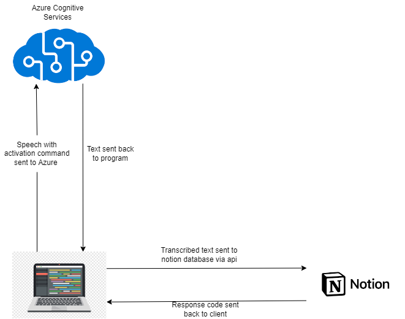

# Speech Recognition with Azure Cognitive Services
----------

## Project description
This project is a simple speech recognition application that uses Azure Cognitive Services to convert speech to text and save the text to a Notion Databse. The application is built using the Python, the Azure Speech SDK and NOTION API. 

## You'll need
- Python 3.8
- Azure Cognitive Services
- Notion API

## How to use
1. Clone the repository
2. Create a Notion Database and get the database ID
3. Create a Notion API key and get the API key
4. Create an Azure Cognitive Services resource and get the API key
5. Create a .env file and add the following variables
    - NOTION_DATABASE_ID
    - NOTION_API_KEY
    - AZURE_API_KEY
6. Run the application
